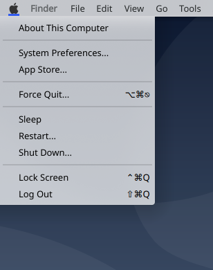

# Kpple Menu

    

## How to install the kpple menu whitout kppleos on KDE Plasma ?

Download the lasted version of kpple Menu from https://github.com/kppleos/org.kpple.kppleMenu, and extract it (it's a zip file) to $HOME/.local/share/plasma/plasmoids/org.kpple.kppleMenu

