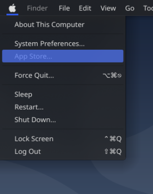

# pearOS Menu
The default pearOS Menu (found in top-left corner, with a pear logo)
<p align="center">
    
</p>

## Preview

<p align="center">
     
</p>

# Installation
* run `install.sh` for automated install

* Manual installation:

```bash
git clone https://github.com/Pear-Project/pearOS-Default-Menu
sudo mkdir -p /usr/share/plasma/plasmoids/xyz.pear.menu
sudo mv pearOS-Default-Menu/* /usr/share/plasma/plasmoids/xyz.pear.menu
```

# Copyright

The `pear_banner` file is made by @RickRollMaster101

This `plasma widget`/`plasmoid`/`application` is made by Kpple.org and released under the GNU General Public License V2.

This present code represents a `fork`/`modification` of the original code

Present code is eited by Alexandru Balan under the Pear Project, and released under the GNU General Public License V2.
